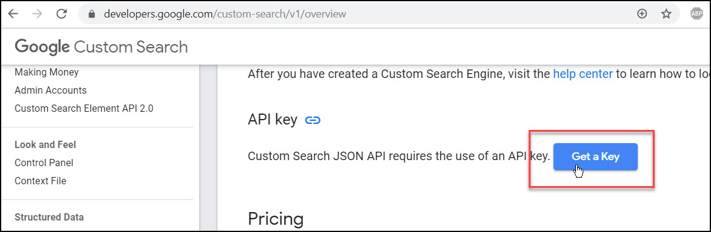
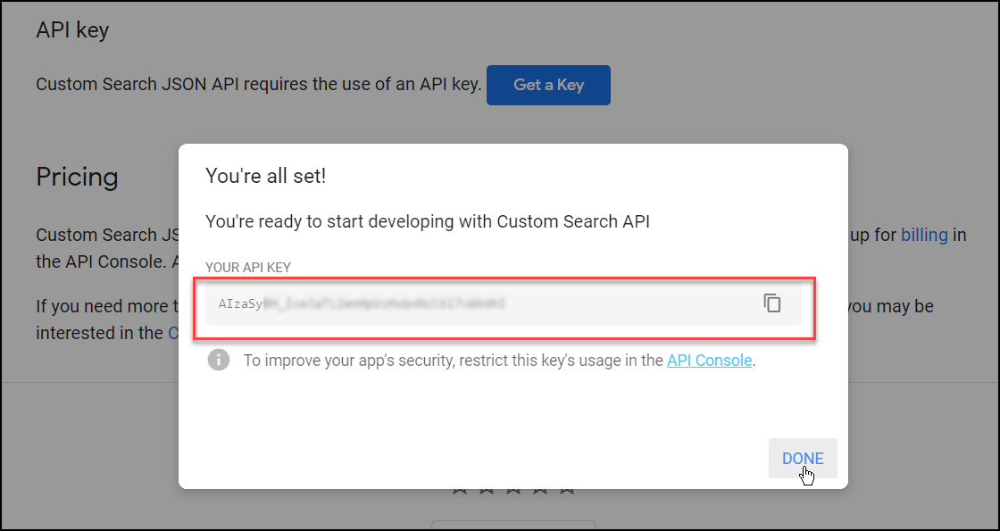

# Welcome to Google Inserter

## Rationale

I often write documentation for all kinds of different projects that I make. And I often need to search google and insert something into the documentation from google. This is usually done by opening a browser window and then searching and then opening the result then copying the link.

This extension aims to solve the problem with a lot of custom options to have room for endless creativity. For example you can use the result title, image, url, and a [lot more other stuff](https://developers.google.com/custom-search/v1/reference/rest/v1/Search#result). The API used provides the same information if not more as the official google search website. So if you can do something with google then you can do that with this extension.

## Setup

This needs an api key from google<sup>[why?](#why-need-an-api-key)</sup> to retrieve results. This may seem tedious at first but it takes like 3 mins and you only have to do it once

### Get an API key

Go to [Google Custom Search overview page](https://developers.google.com/custom-search/v1/overview), scroll down, click get a key.

then do what it says and you'll get an api key


### Save the API Key

Copy the api key and run the command `Insert API Key` and then paste the api key into the input field.
The extension will validate the api key and then if the validation succeeds then the api key will be saved securely.
If the validation fails then the api key is most likely invalid. Re-check the api key

### Change the settings

Then change the extensions settings to your desired settings.
The one setting that is required is the formatting. This setting is changeable per language and you set it per language.
The settings I use is below:
```json
{
    "[markdown]": {
        "google-inserter.format": "[${selectedText}](${link} \"${snippet}\"))"
    },
    "[html]": {
        "google-inserter.format": "<a href=\"${link}\" title=\"${snippet}\">${selectedText}</a>"
    }
}
```

See [formatting](./formatting) for more details

## Why need an API key

This is because scraping the google search results is not optimal and has lot's of small problems and quirks.

Using the official API provides a more robust way of getting the data, and is way faster, more efficient and more reliable.

<small>Google™️ is a trademark of Google LLC.</small>